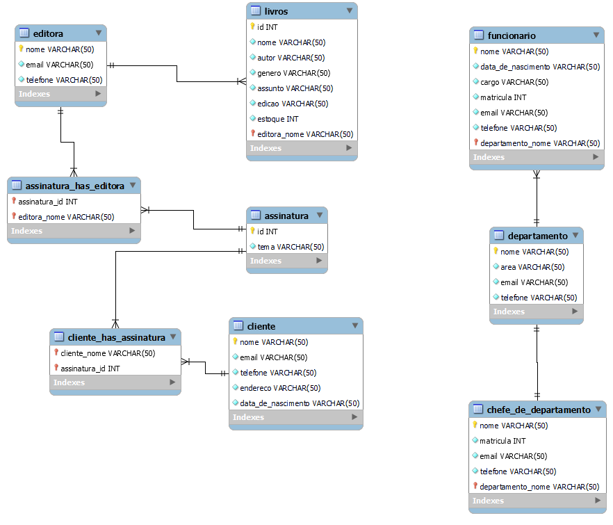

## Projeto Banco de Dados I

Projeto consiste em uma livraria com livros, assinaturas, editoras, clientes, departamentos, funcionarios e chefes de departamento

- `Integrante1`: Guilherme Oliveira e Brito
- `Integrante2`: Lucas Caetano Reis

Para executar o codigo recomento antes executar o script "tabelas" de MySql na raiz do projeto para criação das tabelas

## Diagrama do Projeto

